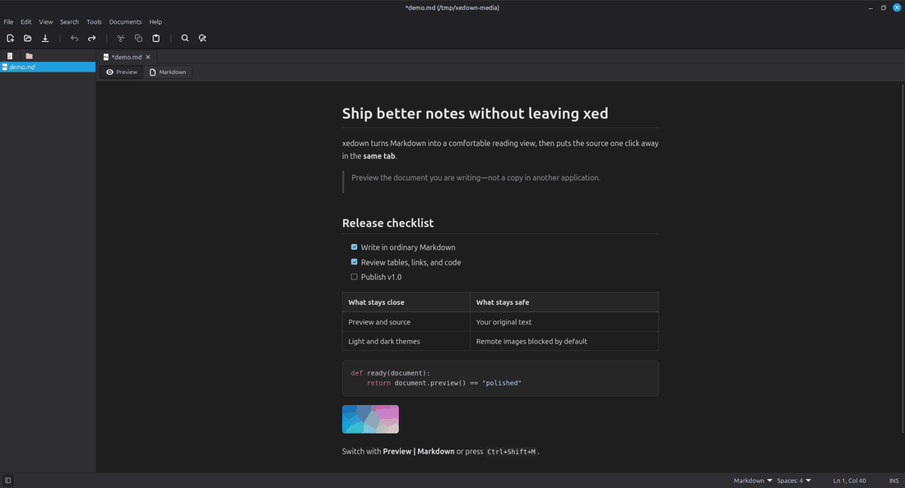
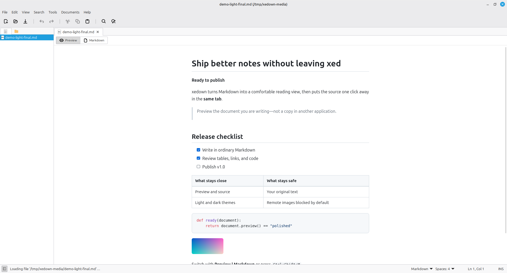
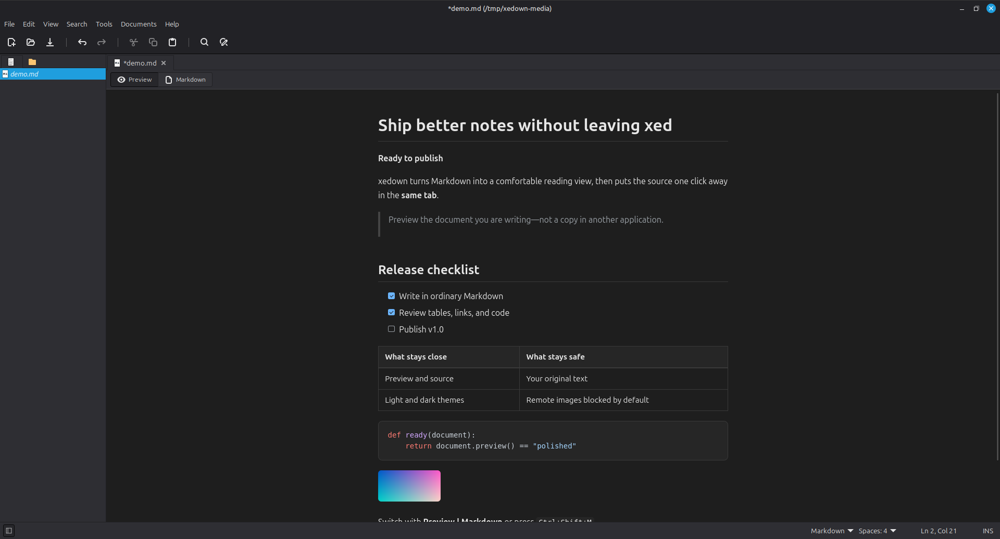
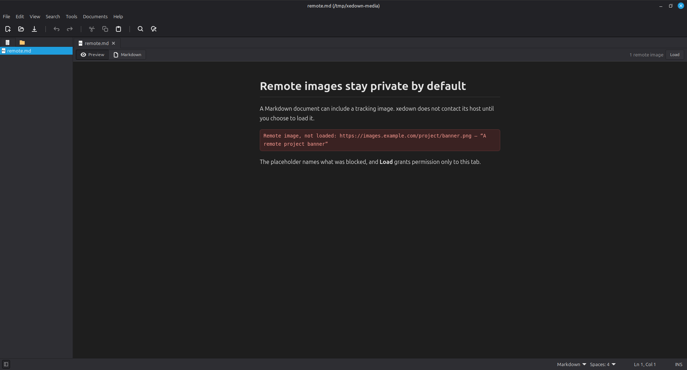

# xedown — Markdown preview for xed on Linux Mint

**xedown is a Markdown preview plugin for the xed text editor on Linux Mint.**

It keeps Preview and Markdown in the same tab, so you can read a polished
document, switch to its source, edit normally in xed, and return to the
rendered view without opening a browser or another application.

The preview includes responsive themes, syntax highlighting, search, custom
CSS, right-to-left layout, external-change watching, and privacy controls for
remote images. Markdown is treated as untrusted content and rendered through
an HTML allowlist under a strict content security policy.



<p align="center"><sub>One tab, two modes. The demo was captured from the supported Linux Mint 22.3/X11 runtime.</sub></p>

## Why xedown?

- **Stay in xed.** Preview and source occupy the same tab and remember their
  own scroll positions.
- **Read comfortably.** Four responsive themes follow the desktop's light or
  dark appearance, with adjustable width and text size.
- **Treat Markdown as untrusted.** Content is rebuilt through an HTML
  allowlist and displayed under a strict content security policy.
- **Control remote-image privacy.** Web images are blocked by default and can
  be allowed for one tab or globally over HTTPS.
- **Use the workflow your way.** Preview search, keyboard shortcuts, custom
  CSS, right-to-left layout, remembered modes, and external-change watching
  are built in.

## Install

Download `xedown-1.0.0.tar.gz`, `install.sh`, and `uninstall.sh` from the v1.0
release, then run:

```bash
chmod +x install.sh uninstall.sh
./install.sh --from xedown-1.0.0.tar.gz
```

The installer checks the runtime before replacing an existing installation
and keeps your preferences during upgrades. Markdown and syntax highlighting
are bundled; there is no pip step.

See [Installation](docs/installation.md) for required packages, upgrades,
manual installation, and installer options. See
[Uninstalling](docs/uninstall.md) to remove the plugin or purge its settings.

## Supported system

The officially supported v1.0 runtime is the stack tested live:

- Linux Mint 22.3
- xed 3.8.9
- Python 3.12.3
- GTK 3.24.41 through the GTK 3.0 API
- WebKitGTK 2.52.3 through the WebKit2 4.1 API
- X11

Python 3.10 and 3.11 run the unit suite in CI but have not been tested live
inside xed. Nearby Mint, xed, Python, WebKitGTK, and display-server versions
are expected to work where the required APIs exist, but remain unverified.
The WebKit2 4.1 API is mandatory; a WebKitGTK that provides only the 4.0 API
cannot load the plugin.

See [Compatibility](docs/compatibility.md) for the evidence and the difference
between supported, expected, and unverified configurations.

## Highlights

- Renders headings, emphasis, lists, task lists, tables, blockquotes,
  footnotes, attribute lists, links, local images, inline code, and fenced code.
- Bundles syntax highlighting for 31 common languages; unknown fences remain
  readable as styled plain code.
- Searches rendered text with `Ctrl+F`, match counts, wrapping navigation, and
  optional case sensitivity.
- Opens web links in the default browser, Markdown links in xed, and asks
  before handing potentially executable local files to the desktop.
- Follows changes made by git, a terminal, another editor, or a coding agent
  without ever writing to the document buffer.
- Scales tall images and gives wide tables their own horizontal scrolling.
- Supports automatic document direction for Arabic, Hebrew, and mixed-language
  documents while keeping code left-to-right.
- Adds keyboard-accessible copy buttons to code blocks and shortcuts for mode
  switching and refresh.

<p align="center">
  
  
</p>

Open *View → Markdown Preview Settings* to configure themes, dimensions,
refreshing, file watching, remote images, fallback display, direction, and how
files open. Every preference is documented in
[Preferences](docs/preferences.md).

## Privacy and security

Remote images are blocked by default because a document can use even an
invisible image to disclose that it was opened. Loading one tells its host your
IP address, approximate location, time, and the requested URL.

xedown itself makes network requests only for permitted remote images. It
accepts HTTPS only, refuses credentials and non-public destinations, rechecks
redirects, applies download and decode limits, and does not give the preview
page general network access.

Read [Remote images and privacy](docs/remote-images.md) before enabling them
globally. The complete boundary, accepted residuals, and how to report a
vulnerability privately are in [SECURITY.md](SECURITY.md).



## Keyboard shortcuts

| Action | Shortcut |
| --- | --- |
| Toggle Preview / Markdown | `Ctrl+Shift+M` |
| Go to Preview | `Ctrl+Shift+1` |
| Go to Markdown source | `Ctrl+Shift+2` |
| Refresh Preview | `Ctrl+Shift+R` |
| Find in the visible surface | `Ctrl+F` |

The mode and refresh actions also appear in xed's *View* menu.

## Important limitations

- xedown supports selected GitHub-flavored Markdown behavior, not full GFM.
- Preview and Markdown keep independent scroll positions; they are not
  synchronized to corresponding source lines.
- Rendering runs on xed's main thread. Large-document guards reduce automatic
  work, but a requested render can still pause the editor.
- Preview can follow a disk change while xed's source buffer waits for you to
  accept its Reload prompt.
- File watching does not follow a document opened through a symbolic link and
  may miss remote writes on NFS or SMB storage.
- xed 3.8.9 can intermittently crash after a tab is moved between windows,
  including when xedown is not installed.
- Screen-reader behavior has been measured narrowly with Orca 46.1 on one X11
  system. This is evidence for specific interactions, not a claim of general
  screen-reader support; keyboard scrolling of the preview is known to be
  silent. See [Accessibility](docs/accessibility.md).

See [Known issues](docs/known-issues.md),
[Markdown compatibility](docs/markdown-compatibility.md), and
[Troubleshooting](docs/troubleshooting.md) for details and workarounds.

## Frequently asked questions

### Is there a Markdown preview plugin for xed?

Yes. xedown adds an in-tab Markdown preview to xed, the default text editor in
Linux Mint. Use the **Preview | Markdown** bar or keyboard shortcuts to move
between the rendered document and its editable Markdown source.

### Can I preview Markdown in xed without opening a browser?

Yes. xedown renders the preview inside the same xed tab. Web links still open
in your default browser when you choose them, while links to Markdown files can
open directly in xed.

### Does xedown work on every Linux distribution?

The officially tested platform is Linux Mint 22.3 with xed 3.8.9, GTK 3.24,
Python 3.12, WebKitGTK 2.52 through the WebKit2 4.1 API, and X11. Nearby Linux
systems may work when they provide the required APIs, but they are not claimed
as supported without live test evidence. See [Compatibility](docs/compatibility.md).

### Is it safe to preview an untrusted Markdown file?

xedown sanitizes rendered HTML with an allowlist and applies a strict content
security policy. Remote images are blocked by default, and enabled downloads
are restricted to HTTPS public destinations with redirect, size, and decode
limits. The complete security boundary and residual risks are documented in
[Security](SECURITY.md) and [Remote images and privacy](docs/remote-images.md).

### How is xedown different from a separate Markdown preview application?

xedown keeps reading and editing in one xed tab, remembers separate scroll
positions for both modes, and follows changes made by other tools. It is aimed
at people who already use xed and want a focused preview without moving their
document into a browser or a second editor.

## Documentation

- [Installation](docs/installation.md) and [uninstalling](docs/uninstall.md)
- [Preferences](docs/preferences.md) and [preview appearance](docs/themes.md)
- [Remote images and privacy](docs/remote-images.md) and
  [security policy](SECURITY.md)
- [Accessibility](docs/accessibility.md) — keyboard, contrast, and measured
  screen-reader behavior
- [Compatibility](docs/compatibility.md), [known issues](docs/known-issues.md),
  and [troubleshooting](docs/troubleshooting.md)
- [Performance](docs/performance.md) and
  [Markdown compatibility](docs/markdown-compatibility.md)
- [Complete documentation index](docs/index.md)

## Contributing

Bug reports, compatibility results, documentation improvements, and code
contributions are welcome. Start with [CONTRIBUTING.md](CONTRIBUTING.md). Report
security vulnerabilities privately as described in [SECURITY.md](SECURITY.md).

## License

[MIT](LICENSE)
