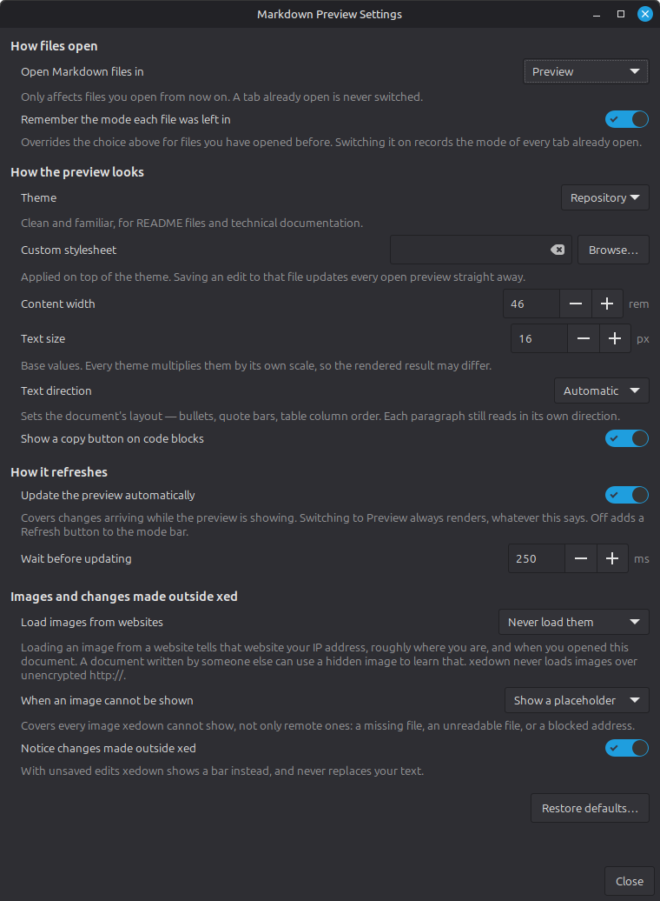

# Preferences

Open **Markdown Preview Settings** from either:

- *View → Markdown Preview Settings*; or
- *Preferences → Plugins → Xedown → Preferences*.



Changes normally apply to every open xedown tab as you make them. **Default
mode** applies only when a new tab is built. **Restore defaults** asks before
returning every preference to its shipped value.

| Preference / JSON key | Choices or range | Default | What it changes |
| --- | --- | --- | --- |
| Default mode / `default_mode` | `preview`, `markdown` | `preview` | How a file not covered by remembered mode opens |
| Remember mode per file / `remember_mode_per_file` | Boolean | `true` | Reopens recent paths in the mode last used |
| Preview theme / `preview_theme` | `focused`, `repository`, `minimal`, `document` | `repository` | Complete light/dark preview design |
| Custom stylesheet / `custom_stylesheet` | File path or `null` | `null` | CSS layered over the selected theme |
| Content width / `content_width_rem` | 30–100 | `46` | Base reading-column width in rem |
| Text size / `text_size_px` | 11–28 | `16` | Base document text scale in px |
| Text direction / `text_direction` | `auto`, `ltr`, `rtl` | `auto` | Document layout direction |
| Code-copy buttons / `code_copy_buttons` | Boolean | `true` | Copy control on fenced code blocks |
| Automatic refresh / `auto_refresh` | Boolean | `true` | Live renders while Preview is visible |
| Refresh delay / `refresh_delay_ms` | 50–2000 | `250` | Debounce in milliseconds before an automatic render |
| Remote images / `remote_images` | `never`, `https` | `never` | Whether xedown may fetch HTTPS images globally |
| Image fallback / `image_fallback` | `placeholder`, `alt`, `hidden` | `placeholder` | How any image that cannot be shown appears |
| Watch external changes / `watch_external_changes` | Boolean | `true` | Whether Preview follows writes made outside xed |

Content width and text size are base values; each theme applies its own scale.
See [Preview appearance](themes.md) for theme details and custom CSS limits.

## Modes and refreshing

Remembered modes are keyed by file path and stored for the 200 most recently
used paths. Moving a file inside xed moves its entry; moving it elsewhere does
not. Disable **Remember mode per file** to stop reading and writing this
history without deleting it.

xedown never renders while Markdown source is the visible surface. Switching
back to Preview always renders, regardless of **Automatic refresh**. When
automatic refresh is off, Preview shows a **Refresh** button; the same action
is available with `Ctrl+Shift+R`.

Large documents can override automatic behavior for that tab. This is a
stability guard, not a preference; see [Performance](performance.md).

## Remote images and fallbacks

The global remote-image preference permits HTTPS images in every document. A
tab's **Load** button gives the same permission only to that tab until it
closes. Loading can disclose your IP address, approximate location, time, and
the requested URL to the image host. Read [Remote images and privacy](remote-images.md)
before enabling it globally.

Image fallback controls presentation only. It does not decide whether an image
is fetched. It applies equally to missing local files, unreadable images,
blocked remote images, and failed downloads.

## External changes

When the file changes on disk and the xed buffer has no unsaved edits, Preview
updates without replacing the source buffer. With unsaved edits, xedown keeps
your work and offers **Reload…**, which hands control to xed's own Revert and
confirmation flow. xedown never writes to your document.

Watching can be unsuitable on a network filesystem, and a document opened
through a symbolic link is not followed. See [Known issues](known-issues.md).

## Settings files

Preferences are stored in:

```text
~/.config/xedown/settings.json
```

or `$XDG_CONFIG_HOME/xedown/settings.json` when `XDG_CONFIG_HOME` is set. Mode
history is beside it in `modes.json`. A fresh install may have no settings file
because only changed values are written.

You may edit the JSON file by hand, but restart xed afterward. Choice values
ignore case and surrounding whitespace; numbers are clamped to their supported
range; wrong types use the default; unknown keys are preserved. `~` is not
expanded in a stylesheet path.

A corrupt or unreadable settings file is moved to `settings.json.corrupt` when
possible and defaults are used. A write failure leaves the new value active for
the current session but it will not survive restart.

Pre-1.0 files that used `remote_images` for the fallback display are migrated
in memory. An explicit `image_fallback` value wins.
